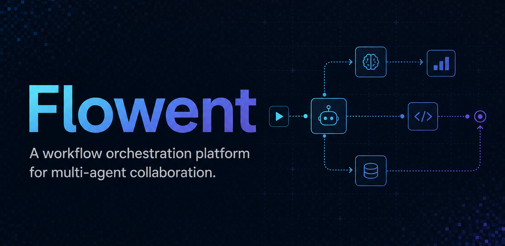

<p align="center">
  
</p>

<p align="center">
  <a href="https://www.npmjs.com/package/flowent"></a>
  <a href="https://github.com/ImFeH2/flowent/blob/main/LICENSE"></a>
  <a href="https://github.com/ImFeH2/flowent/actions/workflows/ci.yml"></a>
  <a href="https://github.com/ImFeH2/flowent/actions/workflows/release.yml"></a>
  <a href="https://github.com/ImFeH2/flowent/actions/workflows/docker-publish.yml"></a>
</p>

# Flowent

A workflow orchestration platform for multi-agent collaboration.

## Install

Install the CLI globally:

```bash
npm install -g flowent
```

Start the server:

```bash
flowent
```

## Docker Compose

Run the server with Docker Compose:

```bash
docker compose up
```

## Technology Stack

- Next.js: application framework and server runtime.
- React: UI rendering model.
- Tailwind CSS: utility-first styling.
- Shadcn UI: standard component patterns.
- Lucide Icons: shared icon set.
- Framer Motion: advanced interaction and transition animation.

## Development

Install dependencies and start the local development server:

```bash
pnpm install
pnpm dev
```

Open `http://localhost:6873`.

You can also run the development container:

```bash
docker compose -f docker-compose.dev.yml up
```
